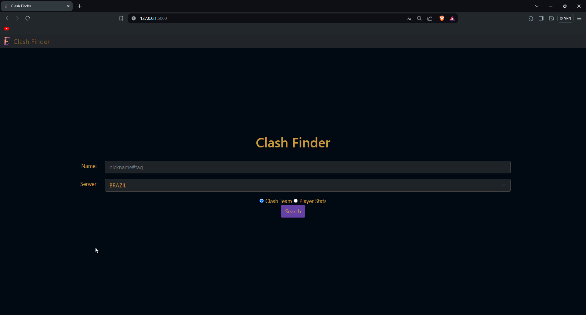

# Clash Finder

## Description
Clash Finder is a web application designed to search and analyze data from League of Legends games. It allows users to quickly search for Clash team information and player statistics.

## Features
- Search for Clash team.
- Display individual player statistics.
- Match history.

## Technologies
This project was developed using:
- Python (Flask for backend)
- HTML/CSS (Bootstrap for frontend)
- JavaScript

## Installation
To install and run this project locally, follow these steps:

1. Clone the repository:
   ```bash
   git clone https://github.com/Nossi201/Clash-Finder.git
2. change API_KEY in question.py:
   API_KEY = "****************"
(u can get it here https://developer.riotgames.com/)
## Screenshots

Below are some screenshots of the application:

### Home Page


### Player History


### Player History Detail View

