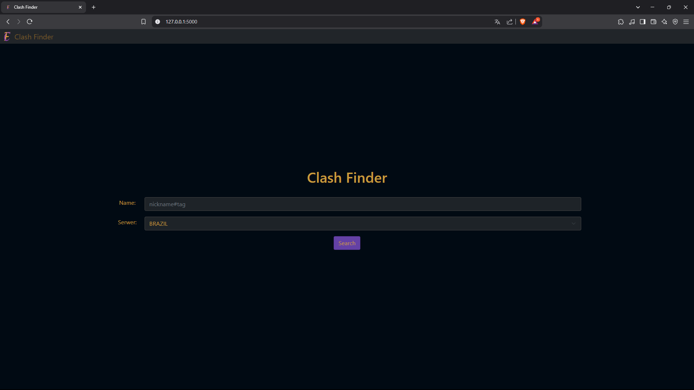

# Clash Finder 🎮

Clash Finder is a comprehensive League of Legends web application built with Flask that allows players to analyze player statistics and view detailed match history. The application features automatic resource updating for champion icons, items, runes, and more.



## Features ✨

- **Player Statistics**: View detailed match history including KDA, items, runes, and match outcomes
- **Auto-updating Resources**: Automatic updates for game assets (champions, items, runes)
- **Multi-Region Support**: Support for all major League of Legends regions
- **SSL/TLS Security**: Secure API communication with proper SSL configuration
- **Responsive Design**: Modern UI using Bootstrap 5

## Technologies Used 🛠️

- **Backend**: Flask (Python 3.x)
- **Frontend**: HTML5, CSS3, JavaScript, Bootstrap 5
- **APIs**: Riot Games API, Data Dragon API, Community Dragon API
- **Asynchronous Operations**: aiohttp, asyncio
- **SSL/TLS**: certifi
- **Resource Management**: Pillow (PIL), schedule
- **Caching**: Custom timed cache decorator

## Prerequisites 📋

Before installation, ensure you have:
- Python 3.7+
- pip (Python package manager)
- Riot Games API key ([Get it here](https://developer.riotgames.com/))

## Installation 🚀

1. Clone the repository:
```bash
git clone https://github.com/Nossi201/Clash-Finder.git
cd Clash-Finder
```

2. Create and activate a virtual environment:
```bash
python -m venv venv
source venv/bin/activate  # On Windows: venv\Scripts\activate
```

3. Install required dependencies:
```bash
pip install -r requirements.txt
```

4. Configure your keys:
   - Open `config.py`
   - Replace the placeholders with your keys:
```python
# Riot API Key (get it from https://developer.riotgames.com/)
RIOT_API_KEY = "YOUR_RIOT_API_KEY_HERE"

# Flask Secret Key (you can generate one using the Python code below)
# import secrets
# secrets.token_hex(32)
FLASK_SECRET_KEY = "YOUR_GENERATED_SECRET_KEY"
```

5. Run the application:
```bash
python app.py
```

The application will be available at `http://localhost:5000`

## Project Structure 📁

```
clash-finder/
│
├── app.py                  # Main Flask application
├── question.py             # Riot API integration & data processing
├── config.py               # Configuration settings
├── game_constants.py       # League of Legends constants
├── resource_downloader.py  # Asset downloading utility
├── resource_manager.py     # Resource management blueprint
├── auto_updater.py         # Automatic resource updates
├── ssl_env_config.py       # SSL configuration
│
├── templates/              # HTML templates
│   ├── index.html
│   ├── player_history.html
│   ├── clash_links.html
│   └── error.html
│
├── static/                 # Static files
│   ├── img/               # Game assets
│   │   ├── champion/
│   │   ├── item/
│   │   ├── runes_and_shards/
│   │   ├── spells/
│   │   └── Logo/
│   ├── js/
│   │   └── player_history.js
│   ├── style.css
│   ├── player_history.css
│   └── players_info.css
│
├── requirements.txt        # Python dependencies
├── lol_version.json       # Current LoL version tracking
└── README.md              # This file
```

## Key Features Explained 🔍

### Resource Management
- Automatic detection of new League of Legends patches
- Downloads and updates game assets (champion icons, items, runes)
- Runs background updates every 6 hours
- Manual update endpoints available

### Player Statistics
- Detailed match history with pagination
- Champion performance metrics
- Item builds and rune choices
- KDA, CS, control wards, kill participation
- Win/loss tracking

### API Optimization
- Caching system to reduce API calls
- Asynchronous requests for faster data retrieval
- Batch processing for team information

## API Endpoints 🌐

- `GET /` - Home page
- `POST /Cheker` - Process player/team search
- `GET /clash_team/<summoner_name>/<server>` - Clash team information
- `GET /player_stats/<summoner_name>/<server>` - Player statistics
- `POST /load_more_matches` - Load additional match history
- `POST /api/resources/update` - Manually trigger resource update
- `GET /api/resources/version` - Check current resource version
- `POST /api/resources/force-update` - Force resource update

## Usage 📝

1. Enter a summoner name with tag (e.g., "Faker#KR1")
2. Select the appropriate server region
3. Choose:
   - **Player Stats**: View comprehensive match history

## Resource Management 🔄

The application automatically manages League of Legends resources:

```bash
# Force update resources manually
python auto_updater.py force

# Check current version
python auto_updater.py check
```

## Screenshots 📸

### Home Page


### Player History


### Player History Detail View


## Configuration ⚙️

### Environment Variables
- `RIOT_API_KEY`: Your Riot Games API key
- `FLASK_SECRET_KEY`: Flask session secret key

### SSL Configuration
The application uses certifi for SSL certificate verification. Custom SSL configuration is available in `ssl_env_config.py`.

## Error Handling 🚫

The application includes comprehensive error handling for:
- Invalid summoner names
- API request failures
- SSL/TLS errors
- Resource download failures
- Rate limiting

## Performance Optimizations 🚀

- Asynchronous API requests
- In-memory caching with TTL
- Batch processing for multiple requests
- Resource versioning to minimize downloads

## License 📄

This project is licensed under the MIT License - see the LICENSE file for details.

## Disclaimer ⚠️

Clash Finder isn't endorsed by Riot Games and doesn't reflect the views or opinions of Riot Games or anyone officially involved in producing or managing League of Legends. League of Legends and Riot Games are trademarks or registered trademarks of Riot Games, Inc. League of Legends © Riot Games, Inc.